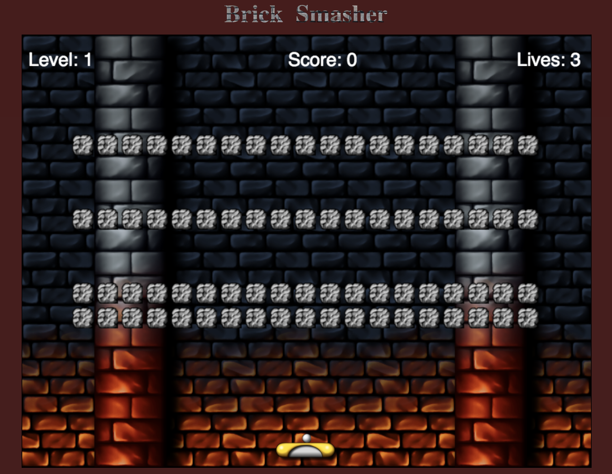

# Brick Destroyer

## Overview

Brick Destroyer is a clone of the classic arcade game breakout. Players can control a paddle along the bottom of the screen with their mouse. They use the paddle to deflect the ball around a level to break bricks.

Every time the ball hits a brick the brick will come closer to being destroyed (it will take from 1 to 3 times to destroy a brick). Upon hitting the paddle the speed will increment slightly, increasing the difficulty the longer the level goes on. If the player misses the ball the number of lives will decrement by 1 and the ball will reset. If the player clears all bricks in the level they move on to the next level and the dificulty increases (increase starting ball speed).

## Functionality and MVP Features

* There are ten levels to cycle through
* Bricks will be generated from a predesigned matrix
* Players use the mouse to move the paddle left and right
* The trajectory of the ball changes based on where it hits the paddle
* speed increases on paddle hit also starting speed increases every level
* Tracks score, current level, and lives

## Wire Frame

### Splash Page Layout

* Vanilla javascript
    * Used for gamelogic
* webpack
    * bundle files
* Canvas
    * Used for rendering and animation

## Implementation Timeline

#### Sat 01/12/19

- [x] Reasearch canvas
- [x] Render paddle and ball

#### Sun 01/12/19

- [x] Animate Ball
- [x] Implement collision with walls
- [x] Have paddle track mouse
- [x] Implement collision with paddle

#### Mon 01/13/19

- [x] Add bricks to level
- [x] Let ball change trajectory based on paddle position
- [x] Detect brick collision
- [x] Reset ball on Miss

#### Tue 01/14/19

- [] Work on level progressio
- [] Work on starting a new game after loss
- [] Finuishing touches